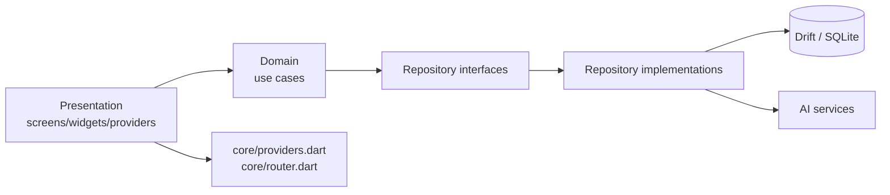

# Architecture — Wine Cellar

Vue d'ensemble maintenue pour orienter rapidement l'exploration du dépôt.
Cette page ne remplace pas les docs détaillées ; elle indique où regarder en premier.

Dernière mise à jour : 27 avril 2026.

## Démarrer ici

Si vous découvrez le projet, l'ordre de lecture recommandé est :

1. [QUICK_START.md](QUICK_START.md)
2. [README.md](README.md)
3. [technical/routing.md](technical/routing.md)
4. [technical/providers.md](technical/providers.md)
5. [technical/database.md](technical/database.md)
6. Une doc feature dans [features/](features/)

## Résumé exécutif

Wine Cellar est une application Flutter de gestion de cave à vin, structurée en feature-first avec Clean Architecture.

La règle de dépendance reste la suivante :

```text
presentation → domain ← data
```

La navigation applicative est centralisée dans `lib/core/router.dart`.
L'injection de dépendances et l'état transverse sont centralisés dans `lib/core/providers.dart`.
La persistance locale repose sur Drift dans `lib/database/app_database.dart`.

## Fichiers de vérité principaux

Ces fichiers doivent être considérés comme prioritaires quand une documentation devient suspecte :

| Sujet | Fichier | Pourquoi |
| --- | --- | --- |
| Routes et écrans accessibles | `lib/core/router.dart` | Définit l'arbre GoRouter réel |
| Injection et état transverse | `lib/core/providers.dart` | Déclare repositories, use cases et préférences globales |
| Schéma et migrations | `lib/database/app_database.dart` | Source de vérité Drift |
| Statistiques | `lib/features/statistics/presentation/providers/statistics_providers.dart` | Déclare l'état et le mode de graphe |
| Outils développeur | `lib/features/developer/presentation/screens/developer_screen.dart` | Utilise les outils globaux exposés par les providers |

## Carte rapide du projet

| Je veux comprendre... | Commencer par | Puis lire |
| --- | --- | --- |
| Le shell applicatif et la navigation | [technical/routing.md](technical/routing.md) | [diagrams/architecture-globale.md](diagrams/architecture-globale.md) |
| Les providers globaux | [technical/providers.md](technical/providers.md) | `lib/core/providers.dart` |
| La base locale et les migrations | [technical/database.md](technical/database.md) | `lib/database/app_database.dart` |
| La feature métier principale | [features/wine_cellar.md](features/wine_cellar.md) | [diagrams/class-diagram-wine-cellar.md](diagrams/class-diagram-wine-cellar.md) |
| L'assistant IA | [features/ai_assistant.md](features/ai_assistant.md) | [diagrams/class-diagram-ai-assistant.md](diagrams/class-diagram-ai-assistant.md) |
| Les statistiques | [features/statistics.md](features/statistics.md) | `lib/features/statistics/presentation/providers/statistics_providers.dart` |
| Les réglages | [features/settings.md](features/settings.md) | `lib/features/settings/presentation/screens/` |
| Les outils développeur | [features/developer.md](features/developer.md) | `lib/features/developer/` |
| Le manuel utilisateur intégré | [features/user_manual.md](features/user_manual.md) | `lib/features/user_manual/` |

## Organisation réelle du dépôt

```text
lib/
  app.dart
  main.dart
  core/
    providers.dart
    router.dart
    theme.dart
    constants.dart
    enums.dart
    errors/
    usecases/
    widgets/
  database/
    app_database.dart
    daos/
    tables/
  features/
    wine_cellar/
    ai_assistant/
    statistics/
    settings/
    user_manual/
    developer/
docs/
  README.md
  QUICK_START.md
  ARCHITECTURE.md
  features/
  technical/
  diagrams/
```

## Features documentées

| Feature | Responsabilité | Couverture actuelle |
| --- | --- | --- |
| `wine_cellar` | CRUD vin, import/export, caves virtuelles, placements | Domain, data, presentation |
| `ai_assistant` | Chat, analyse de vin, OCR local, orchestration multi-fournisseurs | Domain, data, presentation |
| `statistics` | Calcul et affichage des statistiques de cave | Domain, data, presentation |
| `settings` | Paramètres généraux, affichage, IA | Presentation |
| `user_manual` | Manuel utilisateur embarqué | Presentation |
| `developer` | Outils internes de réévaluation et purge | Domain, presentation |

## Navigation réelle

Routes actuellement déclarées dans `lib/core/router.dart` :

| Route | Écran principal | Remarques |
| --- | --- | --- |
| `/cellar` | Liste des vins | Route initiale |
| `/cellar/add` | Ajout d'un vin | Sous-route de cave |
| `/cellar/wine/:id` | Détail d'un vin | Sous-route de cave |
| `/cellar/wine/:id/edit` | Édition d'un vin | Sous-route de détail |
| `/chat` | Assistant IA | Intégré au shell |
| `/cellars` | Liste des caves virtuelles | Intégré au shell |
| `/cellars/:id` | Détail d'une cave virtuelle | Supporte `wineId` et `highlightWineId` en query string |
| `/statistics` | Statistiques | Intégré au shell |
| `/settings` | Réglages | Intégré au shell |
| `/settings/ai` | Réglages IA | Écran dédié existant |
| `/settings/display` | Réglages d'affichage | Écran dédié existant |
| `/developer` | Outils développeur | Route existante dans le router |
| `/developer/reevaluate` | Réévaluation IA | Workflow développeur |
| `/developer/reevaluate/preview` | Prévisualisation de réévaluation | Sous-étape du workflow développeur |
| `/manual` | Manuel utilisateur | Hors shell, section initiale en query string |

## Providers transverses notables

Les providers suivants existent déjà et méritent une lecture rapide avant toute évolution transversale :

| Provider | Rôle |
| --- | --- |
| `wineListLayoutProvider` | Préférence persistée de layout de la liste des vins |
| `splitRatioHorizontalProvider` | Taille persistée du split horizontal |
| `splitRatioVerticalProvider` | Taille persistée du split vertical |
| `visionProviderOverrideProvider` | Override du fournisseur IA pour la vision |
| `visionModelOverrideProvider` | Override du modèle de vision |
| `visionApiKeyOverrideProvider` | Override de clé API dédiée à la vision |
| `developerModeProvider` | Activation persistée du mode développeur |
| `deleteAllWinesUseCaseProvider` | Use case global de suppression totale, utilisé par l'écran développeur |
| `chartModePieProvider` | Mode donut/bar par catégorie statistique |

## Persistance locale

La base Drift est définie dans `lib/database/app_database.dart`.

Points factuels importants :

- Les tables enregistrées sont `Wines`, `FoodCategories`, `WineFoodPairings`, `VirtualCellars` et `BottlePlacements`.
- Les DAOs enregistrés sont `WineDao`, `FoodCategoryDao`, `VirtualCellarDao` et `BottlePlacementDao`.
- La stratégie de migration est non destructive et contient une migration héritée vers les placements de bouteilles par ligne physique.
- Le seed des catégories alimentaires est déclenché à la création et en montée de version.

## Clean Architecture appliquée ici

| Couche | Contenu attendu | Dépendances autorisées |
| --- | --- | --- |
| `domain/` | Entités, interfaces, use cases | Aucun package UI ou data |
| `data/` | Implémentations concrètes, accès données, intégrations | `domain/` + packages externes |
| `presentation/` | Screens, widgets, providers locaux, helpers de présentation purs | `domain/` via use cases et providers |

Exceptions structurelles actuelles connues :

- `settings` et `user_manual` sont aujourd'hui principalement des features de présentation.
- Les providers globaux et une partie de l'orchestration applicative sont regroupés dans `lib/core/providers.dart` au lieu d'être dispersés par feature.

## Flux applicatif simplifié



## Documentation associée

Cette page reste volontairement compacte. Pour le détail :

- Index documentaire : [README.md](README.md)
- Guide d'entrée rapide : [QUICK_START.md](QUICK_START.md)
- Docs par feature : [features/](features/)
- Docs techniques : [technical/](technical/)
- Diagrammes Mermaid : [diagrams/](diagrams/)

## Règle de maintenance

Quand une évolution modifie l'un des éléments suivants, la documentation doit être mise à jour dans le même changement :

- une route dans `lib/core/router.dart`
- un provider global ou un use case global dans `lib/core/providers.dart`
- une table, un DAO ou une migration dans `lib/database/app_database.dart`
- la structure d'une feature ou son point d'entrée principal
- Écriture : `create`, `update`, `delete`
- Occupation : `getWinesByCellarId`, `watchWinesByCellarId`, `placeWine`- Placements individuels : `getPlacementsByWineId`, `watchPlacementsByCellarId`, `removePlacement`, `moveBottlePlacement`
### domain/usecases/

Chaque use case a **une seule** méthode `call()` retournant `Either<Failure, T>`.

| Use Case | Params | Retour | Logique métier |
|----------|--------|--------|----------------|
| `AddWineUseCase` | `WineEntity` | `int` (id) | Valide que le nom n'est pas vide |
| `DeleteWineUseCase` | `int` (id) | `void` | Suppression simple |
| `GetWineByIdUseCase` | `int` (id) | `WineEntity?` | Lecture simple |
| `UpdateWineUseCase` | `WineEntity` | `void` | Valide id non-null + nom non-vide |
| `UpdateWineQuantityUseCase` | `UpdateQuantityParams` | `void` | Clamp à 0 min. Méthode étendue `callWithAction()` pour gérer le cas « quantité à zéro : garder ou supprimer » |
| `ExportWinesUseCase` | `ExportFormat` | `String` | Délègue au repo selon format (JSON/CSV) |
| `ImportWinesFromJsonUseCase` | `String` (JSON) | `int` | Valide contenu + délègue import JSON |
| `ParseCsvImportUseCase` | `ParseCsvImportParams` | `List<CsvImportRow>` | Parse CSV avec mapping de colonnes utilisateur |
| `ImportWinesFromCsvUseCase` | `ImportWinesFromCsvParams` | `int` | Import direct CSV après validation de mapping |
| `GetAllVirtualCellarsUseCase` | `NoParams` implicite / `watch()` | `List<VirtualCellarEntity>` | Liste et observe les celliers |
| `CreateVirtualCellarUseCase` | `VirtualCellarEntity` | `int` | Crée un cellier |
| `UpdateVirtualCellarUseCase` | `VirtualCellarEntity` | `void` | Met à jour nom et dimensions |
| `DeleteVirtualCellarUseCase` | `int` | `void` | Supprime un cellier après dépose des bouteilles |
| `PlaceWineInCellarUseCase` | `PlaceWineParams` | `void` | Place ou retire une bouteille d'un emplacement |
| `GetWinePlacementsUseCase` | `int` (wineId) | `List<BottlePlacementEntity>` | Récupère tous les placements d'un vin (cross-celliers) |
| `MoveBottlesInCellar` | `MoveBottlesParams` | `Unit` | Déplace un groupe de bouteilles sélectionnées : vérifie bornes, collisions, ordonne les mouvements |
| `RemoveBottlePlacementUseCase` | `int` (placementId) | `Unit` | Retire un placement de bouteille |

### data/repositories/

#### `wine_repository_impl.dart` — `WineRepositoryImpl`
- Implémente `WineRepository`
- Injecté avec `WineDao` et `FoodCategoryDao`
- Responsabilités de mapping : `_mapToEntity(Wine)` (DB → domain) et `_mapToCompanion(WineEntity)` (domain → DB)
- Import JSON : supporte deux modes
- Instantané complet moderne : remplace la cave actuelle et restaure vins, celliers et placements
- JSON historique sans `virtualCellars` : import additionnel rétrocompatible, sans réappliquer de placements virtuels
- Import CSV : parsing avec mapping utilisateur + normalisation des champs (quantité, prix, couleur)
- Détection automatique du séparateur CSV : `detectCsvSeparator()` (static) — analyse fréquence et cohérence de `,`, `;`, `\t`
- Support `headerLine` (1-based, nullable) au lieu de `hasHeader` booléen

#### `food_category_repository_impl.dart` — `FoodCategoryRepositoryImpl`
- Implémente `FoodCategoryRepository`
- Mapping `FoodCategory` (DB) → `FoodCategoryEntity` (domain)

#### `virtual_cellar_repository_impl.dart` — `VirtualCellarRepositoryImpl`
- Implémente `VirtualCellarRepository`
- Injecté avec `VirtualCellarDao` et `BottlePlacementDao`
- Mappe `VirtualCellar` et `Wine` (Drift) vers les entités métier
- Gère le placement, le déplacement et le retrait des bouteilles dans les celliers

### presentation/providers/

#### `wine_list_provider.dart`
Providers Riverpod déclaratifs :
- `filteredWinesProvider(WineFilter)` — `StreamProvider.family` réactif
- `allWinesProvider` — `StreamProvider` sans filtre
- `wineCountProvider` / `totalBottlesProvider` — `FutureProvider` stats

#### `bottle_move_state_provider.dart`
- `BottleMoveStateNotifier` — `StateNotifier<BottleMoveStateEntity>` gérant le mode déplacement de bouteilles
- `bottleMoveStateProvider` — `StateNotifierProvider.family` scopé par `cellarId`
- Méthodes : `toggleMovementMode()`, `togglePlacementSelection()`, `clearSelection()`, `startMoving()`, `enableDragMode()`, `exitMovementMode()`

### presentation/screens/

#### `wine_list_screen.dart` — `WineListScreen`
- Écran principal de la cave
- Barre de recherche, chips de filtre (couleur + maturité)
- Layout adaptatif : `ListView` (mobile) / `GridView` (desktop)
- Actions menu : export JSON/CSV + import JSON/CSV
- Import CSV guidé : mapping colonnes (avec pré-analyse IA optionnelle) → prévisualisation extraction → mode direct ou enrichissement IA
- Détection automatique du séparateur CSV (virgule, point-virgule, tabulation)
- Sélection flexible de la ligne d'en-tête (click dans l'aperçu ou champ numérique)
- Vérification avant import CSV et confirmation explicite de préservation de la cave virtuelle actuelle
- Pour le JSON snapshot, confirmation destructive dédiée avant restauration complète de la cave
- Enrichissement IA par lots de 20 vins max via prompts `AiPrompts.buildCsvEnrichmentPrompt` (évaluation complète : correction + normalisation + complétion)
- Validation utilisateur à chaque lot via `CsvBatchValidationDialog` (édition inline, suppression, réévaluation IA individuelle, retry du lot)
- Résumé final détaillé de l'import (lots traités, vins importés, supprimés)
- Gestion quantité via `UpdateWineQuantityUseCase` avec dialogue confirmation
- Surbrillance visuelle (option A) des vins en dernière année théorique de consommation et des vins au-delà de la fenêtre optimale (bordure + badge distincts)
- Surbrillance pilotée par 2 réglages séparés dans `display_settings_screen.dart`, activés par défaut
- FAB → navigue vers `/cellar/add` pour choisir IA ou saisie manuelle

#### `wine_add_screen.dart` — `WineAddScreen`
- Fiche d'ajout complète avec saisie manuelle de tous les champs métier (infos principales, cave, garde, notes)
- Trois actions : redirection vers `/chat`, complétion IA d'une fiche partiellement remplie, ajout manuel direct
- Les boutons « complétion IA » et « ajout manuel » restent grisés tant que nom + millésime ne sont pas valides
- Validation UX : tooltip au survol + popup explicative au clic si prérequis manquants
- Après création d'un vin, propose immédiatement un placement dans un cellier virtuel avec sélection du cellier cible

#### `wine_detail_screen.dart` — `WineDetailScreen`
- Détail complet d'un vin (chargé via `GetWineByIdUseCase`)
- Actions : modifier, supprimer (`DeleteWineUseCase`), ajuster quantité (`UpdateWineQuantityUseCase`)
- Affichage maturité, cépages, accords mets-vin, notes de dégustation
- Remplace les anciennes coordonnées brutes par un aperçu du placement dans le cellier avec navigation vers le cellier concerné
- Ajoute un CTA « Placer en cave » lorsque des bouteilles restent non placées, avec sélection du cellier avant navigation

#### `wine_edit_screen.dart` — `WineEditScreen`
- Formulaire d'édition complet (15+ champs)
- Chargement via `GetWineByIdUseCase`, sauvegarde via `UpdateWineUseCase`
- Sélecteur de couleur, champs numériques validés

#### `virtual_cellar_list_screen.dart` — `VirtualCellarListScreen`
- Liste l'ensemble des celliers virtuels sous forme de cartes
- Permet création, renommage, redimensionnement, choix du thème visuel et suppression
- Affiche la capacité et le nombre d'emplacements par cellier
- Accès à l'éditeur expert (`ExpertCellarEditorScreen`) pour personnalisation avancée

#### `virtual_cellar_detail_screen.dart` — `VirtualCellarDetailScreen`
- Vue grille d'un cellier avec placement interactif des bouteilles
- Tap sur emplacement vide : sélection d'un vin à placer
- Tap sur emplacement occupé : infos bouteille + retrait ou navigation vers la fiche
- Redimensionnement avec alerte avant dépose automatique des bouteilles hors bornes
- La grille garde une taille de cellule fixe et devient scrollable horizontalement et verticalement avec scrollbars visibles
- Supporte un vin pré-sélectionné via la navigation, puis accompagne le placement bouteille par bouteille jusqu'au retour optionnel vers la fiche vin
- Ajoute un filtrage multi-sélection par stade de fenetre de degustation (pret a boire, apogee, etc.) pour n'afficher que les bouteilles correspondantes dans la grille
- **Mode déplacement** : sélection multiple de bouteilles, drag & drop pour déplacer un groupe, avec détection de collisions et vérification des bornes
- Thème visuel appliqué dynamiquement selon le `VirtualCellarTheme` du cellier (classic, premium cave, stone cave, garage industrial)
- Surbrillance visuelle des bouteilles en fin de fenêtre (pastille ambre + liseré) et au-delà de la fenêtre optimale (pastille rouge + liseré), selon les réglages utilisateur

#### `expert_cellar_editor_screen.dart` — `ExpertCellarEditorScreen`
- Éditeur avancé de cellier : personnalisation des dimensions, thème, sélection de cellules
- Modes de sélection : cellule individuelle, ligne complète, colonne complète
- Paramètres initiaux : `initialName`, `initialRows`, `initialColumns`, `initialTheme`, `sourceCellar` optionnel

### presentation/widgets/

#### `wine_card.dart` — `WineCard`
- Carte résumé d'un vin (nom, millésime, couleur, appellation, maturité)
- Boutons +/- pour la quantité
- Callback `onTap` pour la navigation, `onQuantityChanged` pour la mise à jour

#### `csv_column_mapping_dialog.dart` — `CsvColumnMappingDialog`
- Dialogue d'import CSV avec mapping interactif colonnes → champs vin
- Aperçu interactif du CSV (20 lignes) : clic sur un en-tête de colonne → dropdown d'assignation de champ vin
- **Mapping bidirectionnel** : clic sur un champ (chip) → popup de sélection de colonne avec échantillons de données
- Sélection de la ligne d'en-tête : clic sur le numéro de ligne dans l'aperçu ou champ numérique synchronisé
- Auto-détection par mots-clés des en-têtes (nom, millésime, producteur…) en fallback
- Bouton « Pré-analyse IA du mapping » : analyse jusqu'à 100 lignes du CSV pour détecter l'en-tête et le mapping (y compris quand l'en-tête n'est pas la première ligne)
- **Panneau de champs repliable** : section « Champs assignés » avec compteur de progression (ex: « 4/12 »), repliable pour gagner de l'espace sur petits écrans
- Résumé des champs assignés sous forme de chips cliquables (icônes 🤖 IA / 🪄 auto / 👆 manuel)
- Bouton « Réinitialiser » le mapping
- Avertissements de validation des données (millésime suspect, quantité négative)
- Retourne `CsvMappingDialogResult` avec `CsvColumnMapping` + `headerLine` (1-based, null si pas d'en-tête)

#### `csv_batch_validation_dialog.dart` — `CsvBatchValidationDialog`
- Dialogue de validation des lots IA pour l'import CSV avec édition inline
- Cartes dépliables par vin avec tous les champs éditables (`TextFormField`)
- Badge « Modifié » affiché sur les vins touchés par l'utilisateur
- Bouton de suppression individuelle d'un vin du lot
- Bouton « Réévaluer ce vin par l'IA » (callback `onReevaluateSingleWine`)
- Barre résumé : nombre de vins actifs, supprimés, modifiés
- 3 actions : « Annuler l'import » / « Réessayer ce lot » / « Valider ce lot »
- Retourne `CsvBatchValidationResult` (`CsvBatchAction` + liste éditée + indices modifiés)

#### Widgets de thèmes visuels de cellier
- `virtual_cellar_theme_selector.dart` — helpers pour afficher icône et description par thème
- `premium_cave_wrapper.dart` / `premium_cave_screen_background.dart` / `premium_cave_background_painter.dart` — rendu visuel cave premium (boiseries, or)
- `stone_cave_wrapper.dart` / `stone_cave_screen_background.dart` — rendu visuel cave en pierre (grès, chêne)
- `garage_industrial_wrapper.dart` / `garage_industrial_screen_background.dart` — rendu visuel garage industriel (acier, néon)

---

## Feature `ai_assistant/`

Assistant IA conversationnel pour l'ajout de vins par langage naturel et les accords mets-vin.

### domain/entities/

#### `chat_message.dart` — `ChatMessage`, `ChatRole`, `WinePreviewData`
- Message de chat avec `id` (UUID), `content`, `role` (user/assistant/system), `timestamp`
- `WinePreviewData` optionnel pour les données vin associées au message

#### `wine_ai_response.dart` — `WineAiResponse`
- Réponse structurée de l'IA : tous les champs d'un vin + `needsMoreInfo`, `followUpQuestion`
- `estimatedFields` — liste des champs estimés/déduits par l'IA (non fournis par l'utilisateur)
- `confidenceNotes` — raisonnement de l'IA pour les estimations (surtout fenêtre de dégustation)
- `fromJson()` / `toJson()` pour parser la réponse JSON de l'IA
- `isComplete` : vrai si `name` et `color` sont renseignés
- `mergeWith(other)` — fusionne les champs complétés par la recherche web dans l'instance courante
- `fieldWasCompleted(fieldName, other)` — vérifie si un champ a été complété par `other`

### domain/repositories/

#### `ai_service.dart` — `AiService` (abstract), `AiChatResult`, `WebSource`
Interface commune aux 4 providers IA :
- `analyzeWine(userMessage, conversationHistory)` → `AiChatResult`
- `analyzeWineWithWebSearch(userMessage, conversationHistory, systemPromptOverride?)` → `AiChatResult` — recherche web grounding (défaut : fallback vers `analyzeWine`)
- `supportsWebSearch` → `bool` — seul `GeminiService` retourne `true`
- `testConnection()` → `bool`

`AiChatResult` encapsule :
- `textResponse` — texte à afficher dans le chat
- `wineDataList` — liste de `WineAiResponse` extraits
- `isError` / `errorMessage`
- `webSources` — liste de `WebSource` (URI + titre) pour les réponses vérifiées par internet

`WebSource` :
- `uri` — URL de la source
- `title` — titre de la page source

#### `image_text_extractor.dart` — `ImageTextExtractor` (abstract)
Interface d'extraction OCR pour les photos d'étiquette :
- `extractTextFromImage(imagePath)` → `String`

### domain/usecases/

| Use Case | Params | Retour | Logique |
|----------|--------|--------|---------|
| `AnalyzeWineUseCase` | `AnalyzeWineParams` | `AiChatResult` | Appelle `AiService.analyzeWine()` ou `analyzeWineWithWebSearch()` selon `useWebSearch`, convertit erreurs en `AiFailure` |
| `AnalyzeWineFromImageUseCase` | `AnalyzeWineFromImageParams` | `AiChatResult` | Valide imageBytes + MIME type, appelle `AiService.analyzeWineFromImage()`, convertit erreurs en `AiFailure`/`ValidationFailure` |
| `ExtractTextFromWineImageUseCase` | `ExtractTextFromWineImageParams` | `String` | Appelle `ImageTextExtractor.extractTextFromImage()`, valide texte non vide, mappe erreurs en `Failure` |
| `TestAiConnectionUseCase` | `NoParams` | `bool` | Appelle `AiService.testConnection()`, convertit échec en `AiFailure` |

### data/

#### `ai_prompts.dart` — `AiPrompts`
- `systemPrompt` — prompt système complet pour le sommelier IA (extraction JSON, règles anti-hallucination, `estimatedFields`, `confidenceNotes`)
- `buildCellarSearchMessage()` — construit le prompt pour le mode « accord mets-vin » avec le contenu réel de la cave
- `buildWineReviewMessage()` — prompt pour le mode « avis » (sans recherche web, avec règles anti-hallucination)
- `groundedReviewSystemPrompt` — prompt système pour le mode avis avec recherche web Gemini (cite les sources)
- `buildGroundedReviewMessage()` — message utilisateur pour la recherche web grounded
- `fieldCompletionSystemPrompt` — prompt système pour la complétion de champs estimés via recherche web
- `buildFieldCompletionMessage()` — construit le message pour compléter les champs manquants d'un vin
- `buildCsvMappingPrompt()` — prompt pour l'analyse IA du mapping de colonnes CSV. Accepte `allRows` (jusqu'à 100 lignes) pour analyser le fichier en profondeur et détecter l'en-tête même quand elle n'est pas en première ligne. Retourne JSON avec `headerLine` + `mapping`
- `buildCsvEnrichmentPrompt()` — prompt d'enrichissement complet des vins CSV (correction, normalisation, complétion)
- `buildCsvRowDescription()` — formate une ligne CSV pour le prompt d'enrichissement
- `buildSingleWineReevaluationPrompt()` — prompt de réévaluation individuelle d'un vin après modification manuelle

#### `datasources/` — 4 implémentations de `AiService` + 1 datasource OCR

| Fichier | Classe | API | Particularités |
|---------|--------|-----|----------------|
| `openai_service.dart` | `OpenAiService` | OpenAI Chat Completions (via `dart_openai`) | Supporte GPT-4o-mini |
| `gemini_service.dart` | `GeminiService` | Google Generative AI (SDK natif) + REST API (Dio) | Rate limiting 4s, session chat réutilisée, auto-discovery modèle, **seul provider supportant la recherche web** (Gemini Search Grounding via `/v1beta/` REST) |
| `mistral_service.dart` | `MistralService` | Mistral API (compatible OpenAI, via Dio) | Session historique, tracking RPM |
| `ollama_service.dart` | `OllamaService` | API REST locale Ollama (via Dio) | Fonctionne hors-ligne |
| `mlkit_image_text_extractor.dart` | `MlKitImageTextExtractor` | Google ML Kit Text Recognition | OCR on-device depuis photo d'étiquette |

**Pattern commun à toutes les implémentations :**
1. Construction des messages (system prompt + historique + message courant)
2. Appel API
3. Extraction du bloc JSON de la réponse (`_extractWineData`)
4. Nettoyage du texte de réponse (`_cleanTextResponse`)
5. Logging via `ChatLogger`

### presentation/screens/

#### `chat_screen.dart` — `ChatScreen`
- Écran de chat principal
- Trois modes : « Ajouter un vin » / « Accord mets-vin » / « Avis sur un vin » (SegmentedButton `_ChatMode`)
- Gère l'historique des messages en session (static pour persistance inter-navigation)
- Envoi de messages via `AnalyzeWineUseCase`
- Capture photo Android via `image_picker` + OCR via `ExtractTextFromWineImageUseCase`, puis envoi du texte extrait à l'IA
- Ajout de vins à la cave via `AddWineUseCase` + auto-matching des catégories alimentaires
- Après ajout IA, propose aussi un placement immédiat dans un cellier virtuel avec pré-sélection du vin
- En mode accord mets-vin, enrichit la réponse avec des liens rapides vers les fiches détail des vins proposés présents en cave
- En mode avis, utilise Gemini Search Grounding pour chercher des informations vérifiées sur internet (avec sources)
- **Complétion web search** : après analyse d'un vin, si des champs sont estimés (✨) et qu'une clé Gemini est disponible, un bouton « Compléter via Google » propose de vérifier/compléter ces champs via la recherche internet
- Reset de session (réinitialise le chat du service IA sous-jacent)
- Bouton « Ajouter tous les vins » pour les réponses multi-vins
- Une part croissante de l'orchestration déterministe est déléguée à `presentation/helpers/` afin de garder l'écran testable et de limiter la logique métier/UI dans un fichier unique

### presentation/helpers/

Helpers purs ou quasi purs extraits du chat pour sécuriser les refactors par tests unitaires :

- `chat_request_planner.dart` — composition du message IA selon le mode et l'intention
- `chat_context_summary_builder.dart` — résumés de cave et de vin courant pour le raffinage
- `chat_completion_parser.dart` — extraction de JSON depuis les réponses IA
- `chat_response_enricher.dart` — enrichissement des réponses avec liens internes et sources web
- `chat_missing_json_recovery.dart` — relance ciblée quand la réponse ne contient pas de JSON exploitable
- `chat_auto_web_completion_planner.dart` — sélection et batch des vins à compléter via recherche web
- `chat_web_completion_result.dart` — interprétation et fusion d'une réponse de complétion web
- `chat_wine_draft_builder.dart` — mapping `WineAiResponse` → `WineEntity` persistant
- `chat_duplicate_matcher.dart` — normalisation et détection de doublons potentiels
- `chat_add_flow_planner.dart` — décisions d'ajout unitaire, d'ajout groupé et de placement post-ajout
- `chat_mode_transition_planner.dart` — transitions de mode, reset de session et messages d'activation
- `chat_media_helper.dart` — MIME, prompts image et messages de confirmation photo
- `chat_cellar_naming_helper.dart` — nommage automatique des caves créées depuis le chat
- `chat_assistant_link_resolver.dart` — classification des liens assistant en navigation interne ou ouverture externe
- `chat_add_intent_helper.dart` — décision “intention résolue” vs “clarification nécessaire” pour l'ajout de vin
- `chat_prefill_helper.dart` — planification du prefill du chat selon le mode courant et la disponibilité de l'IA
- `chat_web_search_result_builder.dart` — mapping d'un résultat de recherche web vers un `ChatMessage` assistant enrichi de sources
- `chat_image_analysis_helper.dart` — décisions OCR/vision et préparation des paramètres d'analyse d'image
- `chat_missing_fields_helper.dart` — validation et complétion des champs obligatoires manquants avant ajout
- `chat_preview_planner.dart` — décisions d'affichage et d'actions des cartes preview du chat
- `chat_placement_helper.dart` — décisions de placement, routes et messages post-ajout vers les caves

### presentation/widgets/

#### `chat_bubble.dart` — `ChatBubble`
- Bulle de chat avec alignement et couleur selon le rôle (user/assistant)
- Rendu Markdown pour les réponses de l'IA

#### `wine_preview_card.dart` — `WinePreviewCard`
- Carte de prévisualisation d'un `WineAiResponse` dans le chat
- Affiche les champs extraits (nom, appellation, couleur, millésime, cépages…)
- Les champs estimés par l'IA sont signalés par l'icône ✨ (ambre, italique, tooltip « Estimé par l'IA »)
- Affiche une boîte `confidenceNotes` expliquant le raisonnement de l'IA pour les estimations
- Bouton « Ajouter à la cave » / « Déjà ajouté »

---

## Feature `statistics/`

Tableaux de bord et graphiques d'analyse de la cave.

### domain/entities/

#### `cellar_statistics.dart`
- `CellarStatistics` — agrégation de toutes les statistiques de la cave
- `OverviewStats` — KPI globaux (références, bouteilles, valeur, note moyenne, millésimes)
- `ColorStat`, `MaturityStat`, `RegionStat`, `AppellationStat`, `CountryStat`, `VintageStat`, `GrapeVarietyStat`, `RatingStat`, `ProducerStat` — entrées de distribution
- `PriceStats` — statistiques de prix (min, max, médiane, moyenne, tranches)

### domain/repositories/

#### `statistics_repository.dart` — `StatisticsRepository` (abstract)
- `getCellarStatistics()` → `CellarStatistics`

### domain/usecases/

#### `get_cellar_statistics.dart` — `GetCellarStatisticsUseCase`
- Retourne `Either<Failure, CellarStatistics>`, mappe les exceptions en `CacheFailure`

### data/repositories/

#### `statistics_repository_impl.dart` — `StatisticsRepositoryImpl`
- Calcule toutes les distributions à partir de `WineRepository.getAllWines()`
- Comptage en bouteilles (`wine.quantity`), pas en références
- Distributions triées par ordre décroissant de volume
- Tranches de prix prédéfinies (0-5€, 5-10€, … 100+€)

### presentation/providers/

#### `statistics_providers.dart`
- `statisticsRepositoryProvider` — injecte `StatisticsRepositoryImpl`
- `getCellarStatisticsUseCaseProvider` — use case
- `cellarStatisticsProvider` — `FutureProvider<CellarStatistics>` réactif (se rafraîchit quand la cave change)
- `selectedStatCategoryProvider` — catégorie sélectionnée (`StatCategory` enum)
- `StatCategory` — 8 catégories : overview, color, maturity, geography, vintages, grapes, ratingsPrice, producers

### presentation/screens/

#### `statistics_screen.dart` — `StatisticsScreen`
- Écran principal avec sélecteur de catégorie (chips horizontales scrollables, mobile-friendly)
- Chaque catégorie affiche des graphiques dédiés : donut charts (couleur, maturité), bar charts (géographie, cépages, producteurs), timeline (millésimes), KPI (vue d'ensemble), hybride (notes & prix)
- Gère l'état vide (aucun vin) et les erreurs de chargement
- Données réactives : les statistiques se recalculent automatiquement quand la cave change

### presentation/widgets/

| Widget | Rôle |
|---------|-----------|---------|
| Interface repository | `XxxRepository` (dans `domain/`) | `WineRepository` |
| Implémentation | `XxxRepositoryImpl` (dans `data/`) | `WineRepositoryImpl` |
| Interface service | `XxxService` (dans `domain/`) | `AiService` |
| Implémentation service | `XxxService` nommé par provider (dans `data/`) | `GeminiService` |
| Entité domain | `XxxEntity` | `WineEntity` |
| Use case | `XxxUseCase` | `AddWineUseCase` |
| Provider Riverpod | suffixe `Provider` | `wineRepositoryProvider` |
| Écran | `XxxScreen` | `WineListScreen` |
| Widget réutilisable | Nom descriptif | `WineCard`, `ChatBubble` |
| Enum | PascalCase | `WineColor`, `AiProvider` |
| Table Drift | Pluriel | `Wines`, `FoodCategories` |
| DAO Drift | `XxxDao` | `WineDao` |

---

## Points d'évolution identifiés

| # | Point | Priorité | Impact |
|---|-------|----------|--------|
| 1 | **Pas de `@freezed`** sur les entités — `copyWith`, `==`, `hashCode` manuels | Moyenne | Robustesse, réduction du boilerplate |
| 2 | **`fromJson`/`toJson` dans les entités domain** — devrait être dans des DTOs `data/models/` | Faible | Pureté architecturale |
| 3 | **Pas de barrel files** (`index.dart`) | Faible | Simplification des imports |
| 4 | **`ChatLogger` singleton** — non injecté via Riverpod | Faible | Testabilité |
| 5 | **Tests unitaires/widget** — couverture partielle (mocktail), à enrichir | Moyenne | Fiabilité |
| 6 | **Import CSV piloté par prompts IA** (qualité dépendante du provider/modèle) | Moyenne | Peut nécessiter ajustement de prompt selon modèle |
| 7 | **Tesseract OCR** — alternatif plus puissant pour les textes très artistiques. Ajouter `tesseract_ocr` (~15 MB) si MLKit s'avère insuffisant sur certaines étiquettes | Faible | Amélioration OCR, coût en taille d'APK |
