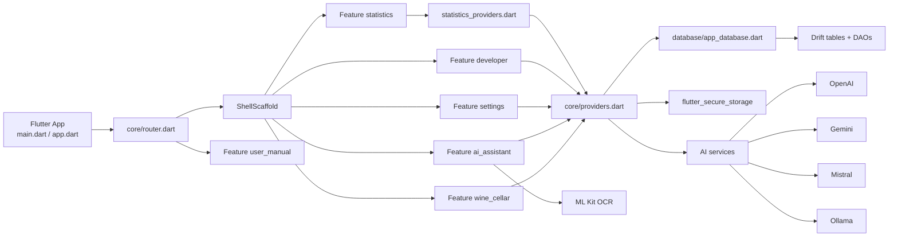

# Diagramme — Architecture globale

Vue d'ensemble des principaux blocs applicatifs et de leurs dépendances.

```mermaid
flowchart LR
	App[Flutter App<br>main.dart / app.dart] --> Router[core/router.dart]
	Router --> Shell[ShellScaffold]

	Shell --> WineCellar[Feature wine_cellar]
	Shell --> AiAssistant[Feature ai_assistant]
	Shell --> Statistics[Feature statistics]
	Shell --> Settings[Feature settings]
	Shell --> Developer[Feature developer]
	Router --> Manual[Feature user_manual]

	WineCellar --> CoreProviders[core/providers.dart]
	AiAssistant --> CoreProviders
	Settings --> CoreProviders
	Developer --> CoreProviders
	Statistics --> StatisticsProviders[statistics_providers.dart]
	StatisticsProviders --> CoreProviders

	CoreProviders --> Database[database/app_database.dart]
	CoreProviders --> SecureStorage[flutter_secure_storage]
	CoreProviders --> AiServices[AI services]

	Database --> Tables[Drift tables + DAOs]
	AiServices --> OpenAI[OpenAI]
	AiServices --> Gemini[Gemini]
	AiServices --> Mistral[Mistral]
	AiServices --> Ollama[Ollama]
	AiAssistant --> MlKit[ML Kit OCR]
```
