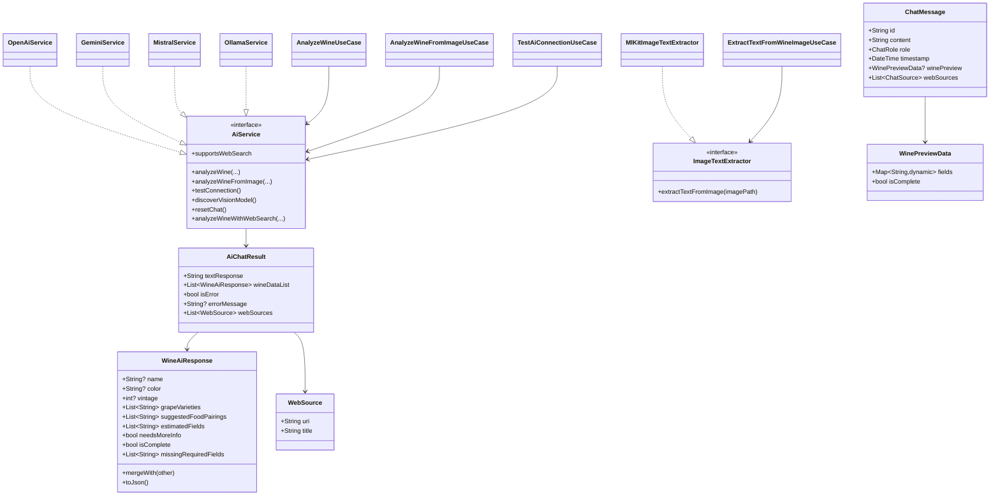

# Diagramme de classes — AI Assistant

Diagramme focalisé sur les abstractions et objets d'échange de la feature `ai_assistant`.

Ce diagramme reflète les abstractions centrales. L'orchestration concrète par fournisseur et overrides vision est documentée dans [../features/ai_assistant.md](../features/ai_assistant.md) et [../technical/providers.md](../technical/providers.md).