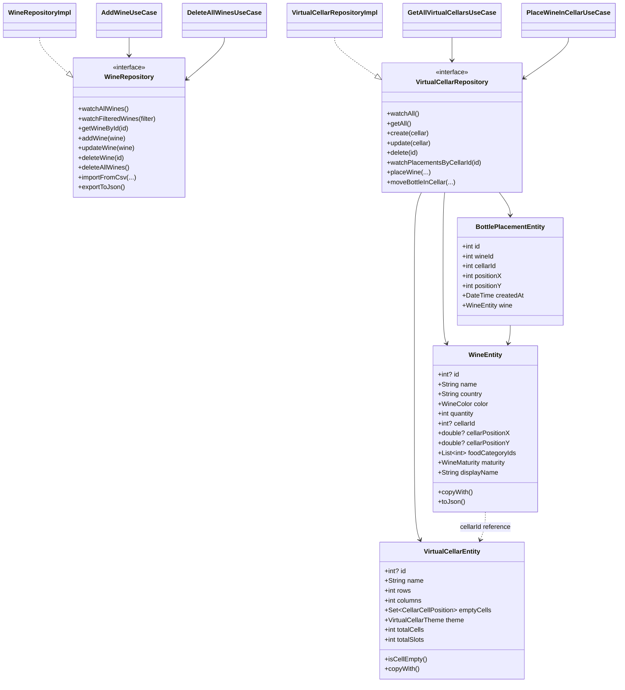

# Diagramme de classes — Wine Cellar

Diagramme focalisé sur les abstractions métier principales de la feature `wine_cellar`.

Note : le domaine contient encore des champs de placement hérités dans `WineEntity` en parallèle de `BottlePlacementEntity`, car la base gère une migration historique vers le modèle par placement physique.