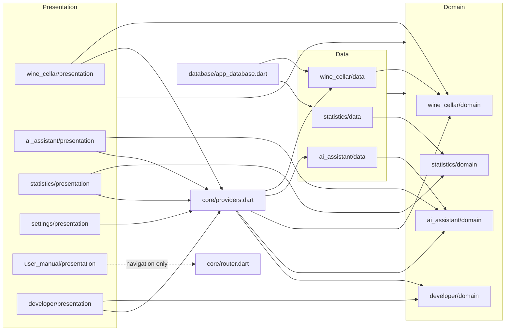

# Diagramme — Dependency Flow Clean Architecture

Rappel du sens de dépendance attendu et des points d'injection concrets du projet.

```mermaid
flowchart LR
	subgraph Presentation
		WineUI[wine_cellar/presentation]
		AiUI[ai_assistant/presentation]
		StatsUI[statistics/presentation]
		SettingsUI[settings/presentation]
		ManualUI[user_manual/presentation]
		DevUI[developer/presentation]
	end

	subgraph Domain
		WineDomain[wine_cellar/domain]
		AiDomain[ai_assistant/domain]
		StatsDomain[statistics/domain]
		DevDomain[developer/domain]
	end

	subgraph Data
		WineData[wine_cellar/data]
		AiData[ai_assistant/data]
		StatsData[statistics/data]
	end

	Presentation --> Domain
	Data --> Domain

	WineUI --> WineDomain
	AiUI --> AiDomain
	StatsUI --> StatsDomain
	DevUI --> DevDomain

	WineData --> WineDomain
	AiData --> AiDomain
	StatsData --> StatsDomain

	Core[core/providers.dart] --> WineData
	Core --> AiData
	Core --> WineDomain
	Core --> AiDomain
	Core --> DevDomain

	DB[database/app_database.dart] --> WineData
	DB --> StatsData

	SettingsUI --> Core
	WineUI --> Core
	AiUI --> Core
	DevUI --> Core
	StatsUI --> Core

	ManualUI -. navigation only .-> CoreRouter[core/router.dart]
```
