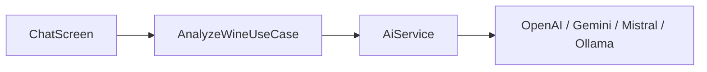
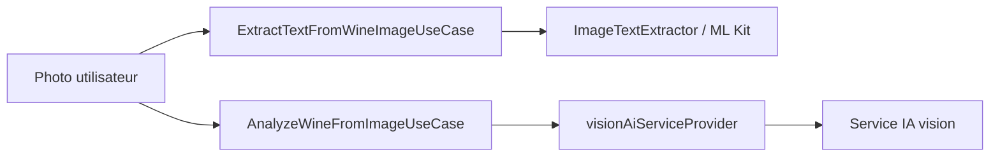

# Feature — AI Assistant

Feature dédiée au chat IA, à l'analyse de vin en texte ou en image, et aux intégrations de fournisseurs externes.

## Entrées principales

| Sujet | Point d'entrée |
| --- | --- |
| Chat IA | `/chat` |
| Réglages IA | `/settings/ai` |

## Responsabilités

- afficher et piloter la conversation IA
- transformer les réponses en données structurées de vin
- supporter l'analyse d'image avec OCR local ou vision multimodale
- encapsuler les fournisseurs OpenAI, Gemini, Mistral et Ollama derrière `AiService`
- tester la connectivité et gérer les overrides de configuration vision

## Structure réelle

| Couche | Contenu notable |
| --- | --- |
| `domain/entities/` | `ChatMessage`, `WineAiResponse` |
| `domain/repositories/` | `AiService`, `ImageTextExtractor` |
| `domain/usecases/` | analyse texte, analyse image, extraction OCR, test de connexion, builders de prompts IA |
| `data/datasources/` | `OpenAiService`, `GeminiService`, `MistralService`, `OllamaService`, `MlKitImageTextExtractor` |
| `presentation/screens/` | `chat_screen.dart` |
| `presentation/helpers/` | orchestration déterministe du chat extraite pour tests unitaires et refactors incrémentaux |
| `presentation/widgets/` | bulles de chat, aperçu de vin |

## Abstractions centrales

| Type | Rôle |
| --- | --- |
| `AiService` | contrat unique pour l'analyse, la vision, le test de connexion et la découverte de modèle vision |
| `ImageTextExtractor` | abstraction OCR locale utilisée avant ou à la place d'une analyse multimodale |
| `AiChatResult` | réponse combinant texte, données structurées, état d'erreur et sources web |
| `WineAiResponse` | représentation structurée d'un vin détecté ou complété par l'IA |
| `ChatMessage` | message d'interface, avec éventuel aperçu de vin et sources web |

## Orchestration par providers globaux

La feature est largement raccordée à `lib/core/providers.dart`.

Providers notables :

- `aiProviderSettingProvider`
- `openAiApiKeyProvider`, `geminiApiKeyProvider`, `mistralApiKeyProvider`, `ollamaUrlProvider`
- `selectedModelProvider`
- `visionProviderOverrideProvider`, `visionModelOverrideProvider`, `visionApiKeyOverrideProvider`
- `useOcrForImagesProvider`
- `geminiFallbackApiKeyProvider`
- `aiServiceProvider`
- `visionAiServiceProvider`
- `geminiWebSearchServiceProvider`
- `visionModelProvider`
- `analyzeWineUseCaseProvider`, `analyzeWineFromImageUseCaseProvider`, `extractTextFromWineImageUseCaseProvider`, `testAiConnectionUseCaseProvider`

## Flux principaux

### Analyse texte

### Analyse image

## Particularités fonctionnelles

- la découverte de modèle vision est encapsulée dans `visionModelProvider`
- Ollama n'est pas utilisé pour la vision dans le provider dédié
- Gemini peut aussi être mobilisé en web search fallback pour compléter des champs estimés
- `WineAiResponse` porte les champs estimés et les notes de confiance, utiles pour expliquer les choix de l'IA
- une partie de la logique non visuelle de `chat_screen.dart` est désormais déplacée dans `presentation/helpers/` pour réduire la taille de l'écran et stabiliser les tests de comportement

## Points d'extension

- ajouter un nouveau fournisseur IA implique d'implémenter `AiService` puis de l'intégrer dans `aiServiceProvider` et `visionAiServiceProvider`
- si une nouvelle stratégie OCR est ajoutée, elle doit respecter `ImageTextExtractor`
- toute évolution du format structuré doit rester compatible avec `WineAiResponse` et l'aperçu de confirmation dans le chat

## À lire ensuite

- [settings.md](settings.md)
- [../technical/providers.md](../technical/providers.md)
- [../diagrams/class-diagram-ai-assistant.md](../diagrams/class-diagram-ai-assistant.md)