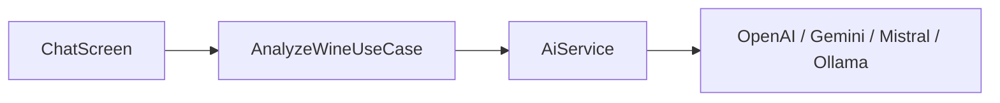
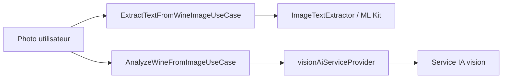
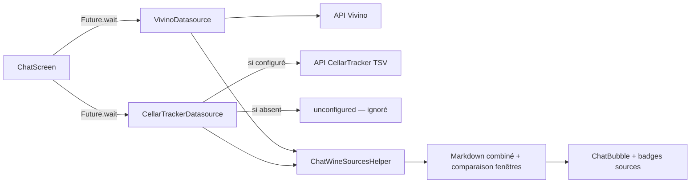

# Feature — AI Assistant

Feature dédiée au chat IA, à l'analyse de vin en texte ou en image, et aux intégrations de fournisseurs externes.

## Entrées principales

| Sujet | Point d'entrée |
| --- | --- |
| Chat IA | `/chat` |
| Réglages IA | `/settings/ai` |

## Responsabilités

- afficher et piloter la conversation IA
- transformer les réponses en données structurées de vin
- supporter l'analyse d'image avec OCR local ou vision multimodale
- encapsuler les fournisseurs OpenAI, Gemini, Mistral et Ollama derrière `AiService`
- tester la connectivité et gérer les overrides de configuration vision

## Structure réelle

| Couche | Contenu notable |
| --- | --- |
| `domain/entities/` | `ChatMessage`, `WineAiResponse`, `VivinoSearchResult`, `CellarTrackerResult` |
| `domain/repositories/` | `AiService`, `ImageTextExtractor` |
| `domain/usecases/` | analyse texte, analyse image, extraction OCR, test de connexion, builders de prompts IA |
| `data/datasources/` | `OpenAiService`, `GeminiService`, `MistralService`, `OllamaService`, `MlKitImageTextExtractor`, `VivinoDatasource`, `CellarTrackerDatasource` |
| `presentation/screens/` | `chat_screen.dart` |
| `presentation/helpers/` | orchestration déterministe du chat, combinaison et comparaison des sources Vivino + CellarTracker |
| `presentation/widgets/` | bulles de chat, aperçu de vin, badges de sources (Vivino, CellarTracker) |

## Abstractions centrales

| Type | Rôle |
| --- | --- |
| `AiService` | contrat unique pour l'analyse, la vision, le test de connexion et la découverte de modèle vision |
| `ImageTextExtractor` | abstraction OCR locale utilisée avant ou à la place d'une analyse multimodale |
| `AiChatResult` | réponse combinant texte, données structurées, état d'erreur, sources web et statut CellarTracker |
| `WineAiResponse` | représentation structurée d'un vin détecté ou complété par l'IA |
| `ChatMessage` | message d'interface, avec éventuel aperçu de vin, sources web et statut CellarTracker |
| `VivinoSearchResult` | résultat Vivino enrichi : note moyenne, nombre d'avis, avis individuels, fenêtre de dégustation |
| `CellarTrackerResult` | résultat CellarTracker : score communautaire, avis individuels, fenêtre de dégustation, statut de source |

## Orchestration par providers globaux

La feature est largement raccordée à `lib/core/providers.dart`.

Providers notables :

- `aiProviderSettingProvider`
- `openAiApiKeyProvider`, `geminiApiKeyProvider`, `mistralApiKeyProvider`, `ollamaUrlProvider`
- `selectedModelProvider`
- `visionProviderOverrideProvider`, `visionModelOverrideProvider`, `visionApiKeyOverrideProvider`
- `useOcrForImagesProvider`
- `geminiFallbackApiKeyProvider`
- `aiServiceProvider`
- `visionAiServiceProvider`
- `geminiWebSearchServiceProvider`
- `visionModelProvider`
- `analyzeWineUseCaseProvider`, `analyzeWineFromImageUseCaseProvider`, `extractTextFromWineImageUseCaseProvider`, `testAiConnectionUseCaseProvider`
- `cellarTrackerUserProvider`, `cellarTrackerPasswordProvider` — credentials CellarTracker persistés (optionnels)
- `cellarTrackerDatasourceProvider` — datasource CellarTracker instancié à partir du secure storage

## Flux principaux

### Analyse texte

```mermaid
flowchart LR
    Chat[ChatScreen] --> AnalyzeWine[AnalyzeWineUseCase]
    AnalyzeWine --> AiService[AiService]
    AiService --> ProviderImpl[OpenAI / Gemini / Mistral / Ollama]
```

### Analyse image

```mermaid
flowchart LR
    Image[Photo utilisateur] --> OCR[ExtractTextFromWineImageUseCase]
    Image --> Vision[AnalyzeWineFromImageUseCase]
    OCR --> Extractor[ImageTextExtractor / ML Kit]
    Vision --> VisionService[visionAiServiceProvider]
    VisionService --> ProviderImpl[Service IA vision]
```

### Review de vin (Vivino + CellarTracker)

```mermaid
flowchart LR
    Chat[ChatScreen] -->|Future.wait| Vivino[VivinoDatasource]
    Chat -->|Future.wait| CT[CellarTrackerDatasource]
    Vivino --> VivinoAPI[API Vivino]
    CT -->|si configuré| CTAPI[API CellarTracker TSV]
    CT -->|si absent| Unconfigured[unconfigured — ignoré]
    Vivino & CT --> Helper[ChatWineSourcesHelper]
    Helper --> Markdown[Markdown combiné + comparaison fenêtres]
    Markdown --> Bubble[ChatBubble + badges sources]
```

Logique de comparaison des fenêtres de dégustation (dans `ChatWineSourcesHelper`) :
- Si les deux sources fournissent une fenêtre et qu'elles divergent de plus de **3 ans** sur le début ou la fin : avertissement explicite avec les deux fenêtres et la fenêtre commune si elle fait au moins **2 ans**.
- Si les fenêtres sont cohérentes : intersection affichée.
- Si une seule source : affichée avec son label.

## Particularités fonctionnelles

- la découverte de modèle vision est encapsulée dans `visionModelProvider`
- Ollama n'est pas utilisé pour la vision dans le provider dédié
- Gemini peut aussi être mobilisé en web search fallback pour compléter des champs estimés
- `WineAiResponse` porte les champs estimés et les notes de confiance, utiles pour expliquer les choix de l'IA
- une partie de la logique non visuelle de `chat_screen.dart` est désormais déplacée dans `presentation/helpers/` pour réduire la taille de l'écran et stabiliser les tests de comportement
- CellarTracker est optionnel : si les credentials sont absents, la datasource retourne immédiatement `CellarTrackerResult.unconfigured()` sans appel réseau
- les notes moyennes Vivino et CellarTracker sont affichées en en-tête avant les avis détaillés
- `VivinoSearchResult` embarque `beginConsume`/`endConsume` récupérés en best-effort depuis l'endpoint `/api/wines/{id}/vintages`

## Couverture des tests

Cette feature bénéficie d'une couverture de tests étendue :

| Couche | Fichiers de test |
| --- | --- |
| **Data (datasources)** | `test/features/ai_assistant/data/datasources/openai_service_test.dart`, `gemini_service_test.dart`, `mistral_service_test.dart`, `ollama_service_test.dart`, `mlkit_image_text_extractor_test.dart`, `vivino_datasource_test.dart`, `cellar_tracker_datasource_test.dart` |
| **Presentation (screens)** | `test/features/ai_assistant/presentation/screens/chat_screen_test.dart`, `chat_screen_window_comparison_test.dart` |

## Points d'extension

- ajouter un nouveau fournisseur IA implique d'implémenter `AiService` puis de l'intégrer dans `aiServiceProvider` et `visionAiServiceProvider`
- si une nouvelle stratégie OCR est ajoutée, elle doit respecter `ImageTextExtractor`
- toute évolution du format structuré doit rester compatible avec `WineAiResponse` et l'aperçu de confirmation dans le chat
- pour ajuster les seuils de divergence des fenêtres : modifier `_divergenceThresholdYears` et `_minCommonWindowYears` dans `chat_wine_sources_helper.dart`
- pour ajouter une troisième source de reviews, s'inspirer du pattern CellarTracker : datasource autonome, statut explicite (found/notFound/unconfigured/unavailable), combinaison dans `ChatWineSourcesHelper`

## À lire ensuite

- [settings.md](settings.md)
- [../technical/providers.md](../technical/providers.md)
- [../diagrams/class-diagram-ai-assistant.md](../diagrams/class-diagram-ai-assistant.md)