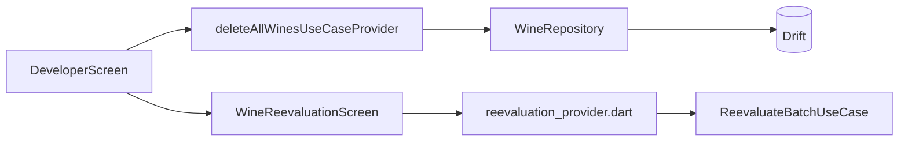

# Feature — Developer

Feature interne réservée aux outils développeur et aux workflows de test avancés.

## Entrées principales

| Sujet | Point d'entrée |
| --- | --- |
| Outils développeur | `/developer` |
| Réévaluation IA | `/developer/reevaluate` |
| Prévisualisation | `/developer/reevaluate/preview` |

## Faits vérifiés

- la feature `developer` existe dans `lib/features/developer/`
- ses routes sont bien déclarées dans `lib/core/router.dart`
- `DeveloperScreen` utilise le use case global `deleteAllWinesUseCaseProvider`
- ce use case global est déclaré dans `lib/core/providers.dart`
- le flag `developerModeProvider` existe et est piloté depuis `settings_screen.dart`

## Structure réelle

| Couche | Contenu notable |
| --- | --- |
| `domain/entities/` | `ReevaluationOptions`, `WineReevaluationChange` |
| `domain/usecases/` | `ReevaluateBatchUseCase` |
| `presentation/providers/` | `reevaluation_provider.dart` |
| `presentation/screens/` | `developer_screen.dart`, `wine_reevaluation_screen.dart`, `reevaluation_preview_screen.dart` |

## Responsabilités

- lancer un workflow de réévaluation IA sur un lot de vins
- afficher une prévisualisation des changements avant application
- fournir un outil destructif de purge totale de la cave pour les scénarios de test

## Flux simplifié

## Points d'attention

- le router enregistre déjà les routes développeur ; ne pas documenter ce flag comme une protection de routing tant que ce comportement n'existe pas réellement
- l'outil de purge est intentionnellement global et transverse, car il touche toute la cave et les placements associés
- toute évolution de ce périmètre doit être relue avec les implications de sécurité et d'usage en production

## Points d'extension

- un nouvel outil développeur doit être documenté ici et raccordé au router s'il expose un nouvel écran
- si un outil réutilise des use cases transverses, documenter explicitement leur provenance dans `lib/core/providers.dart`

## À lire ensuite

- [../technical/routing.md](../technical/routing.md)
- [../technical/providers.md](../technical/providers.md)