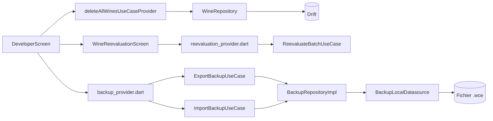

# Feature — Developer

Feature interne réservée aux outils développeur et aux workflows de test avancés.

## Entrées principales

| Sujet | Point d'entrée |
| --- | --- |
| Outils développeur | `/developer` |
| Réévaluation IA | `/developer/reevaluate` |
| Prévisualisation | `/developer/reevaluate/preview` |

## Faits vérifiés

- la feature `developer` existe dans `lib/features/developer/`
- ses routes sont bien déclarées dans `lib/core/router.dart`
- `DeveloperScreen` utilise le use case global `deleteAllWinesUseCaseProvider`
- ce use case global est déclaré dans `lib/core/providers.dart`
- le flag `developerModeProvider` existe et est piloté depuis `settings_screen.dart`

## Structure réelle

| Couche | Contenu notable |
| --- | --- |
| `domain/entities/` | `ReevaluationOptions`, `WineReevaluationChange`, `BackupData` |
| `domain/repositories/` | `BackupRepository` (interface) |
| `domain/usecases/` | `ReevaluateBatchUseCase`, `ExportBackupUseCase`, `ImportBackupUseCase` |
| `data/datasources/` | `BackupLocalDatasource` (chiffrement AES-256-CBC + PBKDF2) |
| `data/repositories/` | `BackupRepositoryImpl` |
| `presentation/providers/` | `reevaluation_provider.dart`, `backup_provider.dart` |
| `presentation/helpers/` | `wine_reevaluation_helper.dart`, `developer_screen_helper.dart` |
| `presentation/screens/` | `developer_screen.dart`, `wine_reevaluation_screen.dart`, `reevaluation_preview_screen.dart` |

## Responsabilités

- lancer un workflow de réévaluation IA sur un lot de vins
- afficher une prévisualisation des changements avant application
- fournir un outil destructif de purge totale de la cave pour les scénarios de test
- **exporter** une sauvegarde chiffrée (cave + config + secrets si dev mode actif)
- **restaurer** une sauvegarde depuis un fichier `.wce`

## Sauvegarde chiffrée (Backup)

### Format du fichier `.wce`

JSON chiffré (AES-256-CBC, PBKDF2 SHA-256, 100 000 itérations) contenant :

```json
{
  "version": 1,
  "created_at": "2026-05-21T10:30:00Z",
  "includes_secrets": true,
  "config": { "ai_provider": "openai", ... },
  "secrets": { "openai_api_key": "sk-...", "cellartracker_user": "...", ... },
  "wines": "<JSON export des vins>"
}
```

- Le champ `secrets` n'est présent que si le mode développeur était actif à l'export.
- La clé AES est dérivée du mot de passe utilisateur (salt + IV aléatoires inclus dans le fichier).

### Providers associés (dans `lib/core/providers.dart`)

| Provider | Type |
| --- | --- |
| `backupLocalDatasourceProvider` | `Provider<BackupLocalDatasource>` |
| `backupRepositoryProvider` | `Provider<BackupRepository>` |
| `exportBackupUseCaseProvider` | `Provider<ExportBackupUseCase>` |
| `importBackupUseCaseProvider` | `Provider<ImportBackupUseCase>` |
| `backupNotifierProvider` | `StateNotifierProvider<BackupNotifier, BackupState>` |

### UX

**Export :** bouton dans `DeveloperScreen` → dialog mot de passe (+ confirmation) → génère un fichier `.wce` partagé via `share_plus` (Android/iOS) ou `FilePicker.saveFile` (Linux/Desktop).

**Import :** bouton dans `DeveloperScreen` → dialog mot de passe → `FilePicker.pickFiles` → déchiffrement → restauration des providers. Les vins sont *ajoutés* (pas de suppression préalable automatique — utiliser « Supprimer tous les vins » si nécessaire).

## Flux simplifié


```mermaid
flowchart LR
    DevScreen[DeveloperScreen] --> DeleteAll[deleteAllWinesUseCaseProvider]
    DeleteAll --> WineRepo[WineRepository]
    WineRepo --> DB[(Drift)]

    DevScreen --> Reevaluate[WineReevaluationScreen]
    Reevaluate --> ReevaluationProvider[reevaluation_provider.dart]
    ReevaluationProvider --> BatchUseCase[ReevaluateBatchUseCase]

    DevScreen --> BackupNotifier[backup_provider.dart]
    BackupNotifier --> ExportUC[ExportBackupUseCase]
    BackupNotifier --> ImportUC[ImportBackupUseCase]
    ExportUC --> BackupRepo[BackupRepositoryImpl]
    ImportUC --> BackupRepo
    BackupRepo --> Datasource[BackupLocalDatasource]
    Datasource --> FileSystem[(Fichier .wce)]
```

## Points d'attention

- le router enregistre déjà les routes développeur ; ne pas documenter ce flag comme une protection de routing tant que ce comportement n'existe pas réellement
- l'outil de purge est intentionnellement global et transverse, car il touche toute la cave et les placements associés
- toute évolution de ce périmètre doit être relue avec les implications de sécurité et d'usage en production
- le fichier `.wce` contient des secrets en clair après déchiffrement — le mot de passe doit être robuste

## Couverture des tests

Cette feature bénéficie d'une couverture de tests de présentation et d'écrans :

| Couche | Fichiers de test |
| --- | --- |
| **Presentation (screens)** | `test/features/developer/presentation/screens/developer_screen_test.dart`, `wine_reevaluation_screen_test.dart`, `reevaluation_preview_screen_test.dart` |

## Points d'extension

- un nouvel outil développeur doit être documenté ici et raccordé au router s'il expose un nouvel écran
- si un outil réutilise des use cases transverses, documenter explicitement leur provenance dans `lib/core/providers.dart`

## À lire ensuite

- [../technical/routing.md](../technical/routing.md)
- [../technical/providers.md](../technical/providers.md)