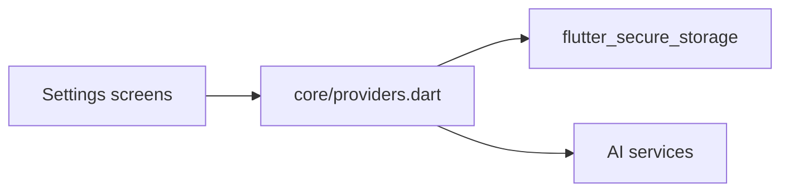

# Feature — Settings

Feature de présentation dédiée aux paramètres applicatifs.

## Entrées principales

| Sujet | Point d'entrée |
| --- | --- |
| Réglages généraux | `/settings` |
| Réglages IA | `/settings/ai` |
| Réglages d'affichage | `/settings/display` |

## Responsabilités

- exposer les préférences globales à l'utilisateur
- modifier les providers persistés de thème, layout et ratios de split
- configurer le fournisseur IA, les clés API, les modèles et les overrides vision
- activer le mode développeur depuis l'UI des paramètres

## Structure réelle

Cette feature est aujourd'hui concentrée dans la couche `presentation/` :

- `settings_screen.dart`
- `ai_settings_screen.dart`
- `display_settings_screen.dart`
- `presentation/helpers/ai_settings_form_helper.dart` pour la normalisation et le chargement initial du formulaire IA
- `presentation/helpers/ai_settings_provider_config_helper.dart` pour les libellés, hints et règles d'affichage par fournisseur IA
- `presentation/helpers/settings_overview_helper.dart` pour les sous-titres et règles d'affichage du hub de réglages
- `presentation/helpers/display_settings_options_helper.dart` pour les options de layout, de thème visuel et d'alertes de consommation

La logique d'état et la persistance associées vivent majoritairement dans `lib/core/providers.dart`.

## Providers concernés

### Affichage et ergonomie

- `appVisualThemeProvider`
- `wineListLayoutProvider`
- `highlightLastConsumptionYearProvider`
- `highlightPastOptimalConsumptionProvider`
- `splitRatioHorizontalProvider`
- `splitRatioVerticalProvider`
- `shellNavigationRailCollapsedProvider`

### IA et connectivité

- `aiProviderSettingProvider`
- `openAiApiKeyProvider`
- `geminiApiKeyProvider`
- `mistralApiKeyProvider`
- `ollamaUrlProvider`
- `selectedModelProvider`
- `visionProviderOverrideProvider`
- `visionModelOverrideProvider`
- `visionApiKeyOverrideProvider`
- `useOcrForImagesProvider`
- `geminiFallbackApiKeyProvider`

### Outils développeur

- `developerModeProvider`

## Points factuels importants

- l'écran de réglages IA existe bien dans `ai_settings_screen.dart`
- sa route est déclarée dans le router sous `/settings/ai`
- le mode développeur est lu et modifié depuis `settings_screen.dart`
- les routes développeur sont enregistrées dans `lib/core/router.dart` indépendamment de ce flag ; le flag sert à piloter le comportement d'UI et l'accès fonctionnel en amont

## Flux simplifié

## Points d'extension

- un nouveau réglage global doit en priorité être ajouté comme provider persistant cohérent avec les notifiers existants
- si un réglage influe sur la navigation, mettre aussi à jour [../technical/routing.md](../technical/routing.md)
- si un réglage influe sur l'assistant IA, mettre aussi à jour [ai_assistant.md](ai_assistant.md)

## À lire ensuite

- [../technical/providers.md](../technical/providers.md)
- [ai_assistant.md](ai_assistant.md)