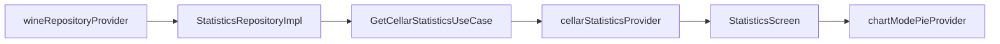

# Feature — Statistics

Feature de calcul et de visualisation des statistiques de la cave.

## Entrée principale

| Sujet | Point d'entrée |
| --- | --- |
| Tableau de bord statistiques | `/statistics` |

## Responsabilités

- agréger les données issues des vins de la cave
- exposer un état réactif actualisé quand la cave change
- sélectionner une catégorie statistique active
- mémoriser le mode de rendu donut/bar par catégorie

## Structure réelle

| Couche | Contenu notable |
| --- | --- |
| `domain/entities/` | `CellarStatistics` |
| `domain/repositories/` | `StatisticsRepository` |
| `domain/usecases/` | `GetCellarStatisticsUseCase` |
| `data/repositories/` | `StatisticsRepositoryImpl` |
| `presentation/providers/` | `statistics_providers.dart` |
| `presentation/screens/` | `statistics_screen.dart` |
| `presentation/helpers/` | `statistics_screen_helper.dart`, `overview_section_helper.dart` |
| `presentation/widgets/` | sections overview, geography, grapes, producers, price, charts donut/bar |

## Providers locaux importants

Les providers de cette feature ne sont pas centralisés dans `lib/core/providers.dart`.
La source de vérité locale est `lib/features/statistics/presentation/providers/statistics_providers.dart` pour l'état d'écran.
L'instanciation du repository est centralisée dans `lib/core/providers.dart` via `statisticsRepositoryProvider` pour éviter une dépendance directe `presentation → data`.

| Provider | Rôle |
| --- | --- |
| `getCellarStatisticsUseCaseProvider` | expose le use case de calcul |
| `cellarStatisticsProvider` | charge les statistiques effectives |
| `allWinesStreamProvider` | invalide automatiquement les stats quand les vins changent |
| `selectedStatCategoryProvider` | catégorie courante à l'écran |
| `chartModePieProvider` | état du mode donut/bar par catégorie |

## Flux de données

## Points d'attention

- la feature dépend des vins existants ; elle ne persiste pas ses propres données métier
- le rafraîchissement est piloté par le flux `watchAllWines()` du repository des vins
- `chartModePieProvider` est un provider familial, un état distinct par catégorie statistique

## Points d'extension

- une nouvelle section statistique implique généralement : extension de `CellarStatistics`, adaptation du repository, du use case, des widgets et éventuellement d'une nouvelle valeur dans `StatCategory`
- si un nouveau type de graphe est introduit, il faut vérifier l'impact sur `chartModePieProvider`

## À lire ensuite

- [wine_cellar.md](wine_cellar.md)
- [../technical/providers.md](../technical/providers.md)