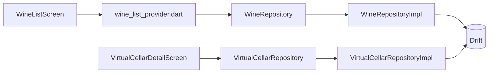

# Feature — Wine Cellar

Feature métier principale de l'application.
Elle porte la gestion des vins, l'import/export et les caves virtuelles.

## Entrées principales

| Sujet | Point d'entrée |
| --- | --- |
| Liste des vins | `/cellar` |
| Ajout | `/cellar/add` |
| Détail | `/cellar/wine/:id` |
| Édition | `/cellar/wine/:id/edit` |
| Liste des caves virtuelles | `/cellars` |
| Détail d'une cave virtuelle | `/cellars/:id` |

## Responsabilités

- gérer le cycle de vie d'un vin
- gérer l'import/export JSON et CSV
- gérer les catégories d'accords mets-vins
- gérer les caves virtuelles et les placements de bouteilles
- exposer les écrans et widgets principaux du domaine métier

## Structure réelle

| Couche | Contenu notable |
| --- | --- |
| `domain/entities/` | `WineEntity`, `VirtualCellarEntity`, `BottlePlacementEntity`, filtres, tris, mapping CSV |
| `domain/repositories/` | `WineRepository`, `FoodCategoryRepository`, `VirtualCellarRepository` |
| `domain/usecases/` | CRUD vin, import/export, caves virtuelles, placements |
| `data/repositories/` | implémentations Drift des repositories |
| `presentation/screens/` | liste, détail, ajout, édition, caves virtuelles, éditeur expert |
| `presentation/helpers/` | `expert_cellar_editor_helper.dart`, `wine_list_screen_helper.dart`, `wine_detail_screen_helper.dart`, `virtual_cellar_detail_helper.dart`, `virtual_cellar_list_helper.dart` |
| `presentation/providers/` | `wine_list_provider.dart`, `bottle_move_state_provider.dart` |
| `presentation/widgets/` | cartes vin, wrappers visuels de cave, UI d'import CSV |

## Objets métier clés

| Classe | Rôle |
| --- | --- |
| `WineEntity` | référence métier d'un vin, avec quantité, fenêtre de dégustation, notes, accords et métadonnées |
| `VirtualCellarEntity` | description d'une cave virtuelle en grille 2D, avec cases indisponibles et thème |
| `BottlePlacementEntity` | placement d'une bouteille physique dans une cellule de cave |

Points importants :

- `WineEntity` contient encore des champs hérités liés au placement (`cellarId`, `cellarPositionX`, `cellarPositionY`).
- `BottlePlacementEntity` modélise désormais le placement physique bouteille par bouteille.
- `VirtualCellarRepository` expose à la fois des flux réactifs et des opérations métier retournant `Either<Failure, T>`.

## Flux principal

## Use cases majeurs

| Domaine | Use cases notables |
| --- | --- |
| Vin | `AddWineUseCase`, `GetWineByIdUseCase`, `UpdateWineUseCase`, `DeleteWineUseCase`, `DeleteAllWinesUseCase` |
| Import/export | `ExportWinesUseCase`, `ImportWinesFromJsonUseCase`, `ParseCsvImportUseCase`, `ImportWinesFromCsvUseCase` |
| Caves virtuelles | `GetAllVirtualCellarsUseCase`, `CreateVirtualCellarUseCase`, `UpdateVirtualCellarUseCase`, `DeleteVirtualCellarUseCase` |
| Placements | `PlaceWineInCellarUseCase`, `GetWinePlacementsUseCase`, `MoveBottlesInCellar`, `RemoveBottlePlacementUseCase` |

## Dépendances transverses

- les repositories et use cases globaux sont instanciés dans `lib/core/providers.dart`
- la persistance repose sur `lib/database/app_database.dart` et les DAOs associés
- les statistiques consomment cette feature via `wineRepositoryProvider`
- la feature développeur réutilise `deleteAllWinesUseCaseProvider`

## Points d'extension

- ajouter un nouveau champ métier d'un vin implique généralement : entité, table Drift, DAO, repository impl, use cases et écrans
- étendre l'import CSV implique aussi la doc utilisateur et le mapping CSV
- toute évolution des placements doit tenir compte de la coexistence entre anciens champs de position dans `WineEntity` et table `BottlePlacements`

## À lire ensuite

- [../technical/database.md](../technical/database.md)
- [../technical/providers.md](../technical/providers.md)
- [../diagrams/class-diagram-wine-cellar.md](../diagrams/class-diagram-wine-cellar.md)