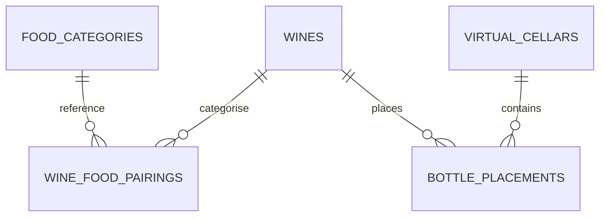

# Base de données

La persistance locale repose sur Drift et `lib/database/app_database.dart` est la source de vérité principale.

## Version de schéma

Le schéma courant est versionné via `AppConstants.databaseVersion` et vaut actuellement `6`.

## Tables enregistrées

| Table | Rôle |
| --- | --- |
| `Wines` | données principales des vins |
| `FoodCategories` | catalogue de catégories alimentaires |
| `WineFoodPairings` | association vin ↔ catégories alimentaires |
| `VirtualCellars` | caves virtuelles en grille |
| `BottlePlacements` | placements physiques bouteille par bouteille |

## DAOs enregistrés

| DAO | Rôle |
| --- | --- |
| `WineDao` | accès principal aux vins |
| `FoodCategoryDao` | catégories alimentaires |
| `VirtualCellarDao` | caves virtuelles |
| `BottlePlacementDao` | placements de bouteilles |

## Relations fonctionnelles

## Migration et initialisation

`AppDatabase` applique la stratégie suivante :

- `onCreate` : création de toutes les tables puis seed des catégories alimentaires
- `onUpgrade` : migration non destructive via `_migrateWithoutDataLoss()` puis seed des catégories alimentaires

Mécanismes internes importants :

- `_createTableIfMissing()` crée une table seulement si elle n'existe pas encore
- `_addColumnIfMissing()` ajoute une colonne si elle manque
- une migration héritée transfère les anciennes positions stockées dans `wines` vers `bottle_placements`

## Seed métier

Les catégories alimentaires par défaut proviennent de `defaultFoodPairingCatalog` dans `lib/core/food_pairing_catalog.dart`.
Le seed est rejoué à la création et à la montée de version, avec vérification des noms déjà présents.

## Résolution du fichier SQLite

Le fichier de base est résolu ainsi :

- par défaut dans le répertoire documents de l'application
- sur desktop, tentative d'utilisation du répertoire d'installation s'il est accessible en écriture
- si une base existe déjà dans documents et pas encore dans le dossier d'installation, elle est copiée lors de la résolution

## Implications pour les évolutions

- toute nouvelle table ou colonne doit être gérée sans perte de données
- toute évolution du modèle des placements doit tenir compte de la migration historique depuis `Wines`
- après modification des tables ou DAOs, régénérer les fichiers Drift

## À lire ensuite

- [providers.md](providers.md)
- [../features/wine_cellar.md](../features/wine_cellar.md)