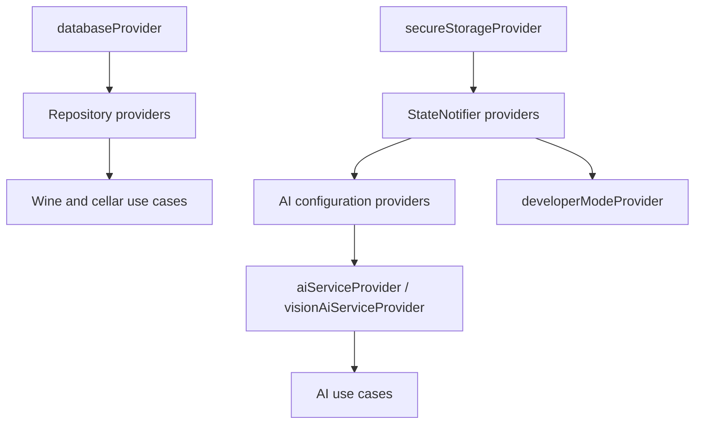

# Providers globaux et injection

Cette page documente l'orchestration centralisée dans `lib/core/providers.dart` et les liens avec les providers locaux des features.

## Rôle du fichier

`lib/core/providers.dart` mélange volontairement plusieurs responsabilités transverses :

- création des singletons d'infrastructure
- instanciation des repositories concrets
- exposition des use cases globaux
- stockage persistant de préférences et de paramètres
- composition des services IA

## Vue synthétique

## Groupes de providers

### Infrastructure et repositories

| Provider | Rôle |
| --- | --- |
| `databaseProvider` | instance principale `AppDatabase` |
| `secureStorageProvider` | accès à `flutter_secure_storage` |
| `wineRepositoryProvider` | repository métier des vins |
| `foodCategoryRepositoryProvider` | repository des catégories alimentaires |
| `virtualCellarRepositoryProvider` | repository des caves virtuelles et placements |
| `statisticsRepositoryProvider` | repository de statistiques construit à partir des vins |

### Shell, thème et préférences d'affichage

| Provider | Rôle |
| --- | --- |
| `shellNavigationRailCollapsedProvider` | état compact du rail de navigation |
| `immersiveCellarThemeProvider` | override temporaire depuis le détail de cave |
| `appVisualThemeProvider` | thème visuel global persisté |
| `wineListLayoutProvider` | préférence de layout de liste |
| `highlightLastConsumptionYearProvider` | surlignage de dernière année théorique |
| `highlightPastOptimalConsumptionProvider` | surlignage des vins au-delà de la fenêtre optimale |
| `splitRatioHorizontalProvider` | ratio persisté du split horizontal |
| `splitRatioVerticalProvider` | ratio persisté du split vertical |

### Configuration IA

| Provider | Rôle |
| --- | --- |
| `aiProviderSettingProvider` | fournisseur IA principal |
| `openAiApiKeyProvider` | clé OpenAI |
| `geminiApiKeyProvider` | clé Gemini |
| `mistralApiKeyProvider` | clé Mistral |
| `ollamaUrlProvider` | URL Ollama |
| `selectedModelProvider` | modèle principal |
| `visionProviderOverrideProvider` | fournisseur spécifique à la vision |
| `visionModelOverrideProvider` | modèle spécifique à la vision |
| `visionApiKeyOverrideProvider` | clé API spécifique à la vision |
| `useOcrForImagesProvider` | bascule OCR local vs vision IA |
| `geminiFallbackApiKeyProvider` | clé fallback pour recherche web Gemini |

### Services et use cases IA

| Provider | Rôle |
| --- | --- |
| `aiServiceProvider` | service IA principal selon la config courante |
| `visionAiServiceProvider` | service IA dédié à l'analyse d'image avec overrides |
| `geminiWebSearchServiceProvider` | service Gemini dédié à la recherche web |
| `imageTextExtractorProvider` | OCR local |
| `extractTextFromWineImageUseCaseProvider` | use case OCR |
| `analyzeWineUseCaseProvider` | analyse texte |
| `analyzeWineFromImageUseCaseProvider` | analyse image |
| `testAiConnectionUseCaseProvider` | test de connexion |
| `visionModelProvider` | découverte du modèle vision disponible |

### Use cases vin et caves virtuelles

| Provider | Rôle |
| --- | --- |
| `addWineUseCaseProvider` | ajout de vin |
| `getWineByIdUseCaseProvider` | chargement d'un vin |
| `deleteWineUseCaseProvider` | suppression unitaire |
| `deleteAllWinesUseCaseProvider` | suppression totale de la cave |
| `updateWineUseCaseProvider` | mise à jour d'un vin |
| `updateWineQuantityUseCaseProvider` | mise à jour de quantité |
| `exportWinesUseCaseProvider` | export |
| `importWinesFromJsonUseCaseProvider` | import JSON |
| `parseCsvImportUseCaseProvider` | parsing CSV |
| `importWinesFromCsvUseCaseProvider` | import CSV |
| `getAllVirtualCellarsUseCaseProvider` | récupération des caves virtuelles |
| `createVirtualCellarUseCaseProvider` | création de cave virtuelle |
| `updateVirtualCellarUseCaseProvider` | mise à jour de cave |
| `deleteVirtualCellarUseCaseProvider` | suppression de cave |
| `placeWineInCellarUseCaseProvider` | placement de bouteille |
| `removeBottlePlacementUseCaseProvider` | retrait de placement |
| `getWinePlacementsUseCaseProvider` | lecture des placements |
| `moveBottlesInCellarUseCaseProvider` | déplacement d'une bouteille |

### Mode développeur

| Provider | Rôle |
| --- | --- |
| `developerModeProvider` | activation persistée du mode développeur |

## Providers hors `lib/core/providers.dart`

Tous les providers ne sont pas globaux.
Exemple notable : la feature statistiques garde sa logique d'écran dans `lib/features/statistics/presentation/providers/statistics_providers.dart`, avec `getCellarStatisticsUseCaseProvider`, `cellarStatisticsProvider`, `selectedStatCategoryProvider` et `chartModePieProvider`.

## Règles de maintenance

- si vous ajoutez un provider transverse, documentez-le ici
- si vous ajoutez un provider uniquement local à une feature, documentez-le dans la doc de cette feature
- si un provider modifie la navigation ou la persistance, synchroniser aussi [routing.md](routing.md) ou [database.md](database.md)